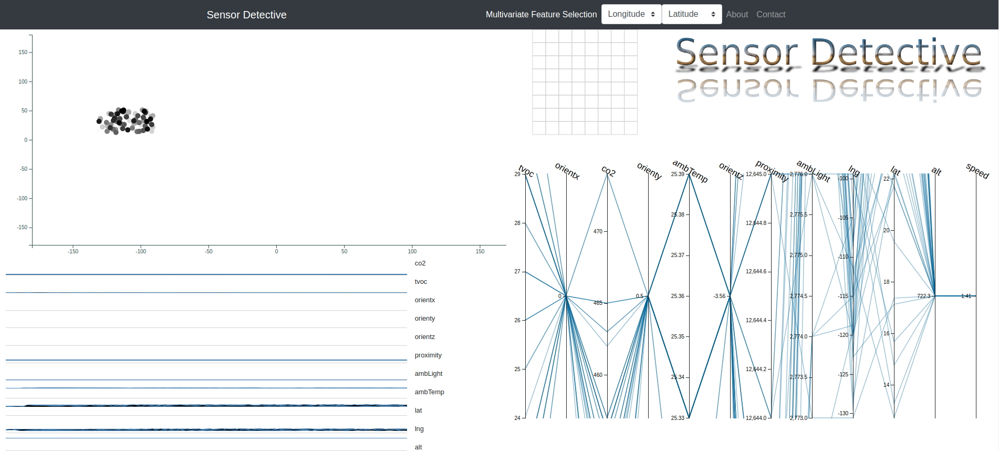

# Sensor Detective

Sensor detective was developed for a challenge in HackAZ 2019.
It tries to add visual mining tools to the traditional dashboard which usually
consists of simple timeseries visualization or fancy (and sometimes messy) 3d graphs
or infographics.

To see a discussion about the value of parallel coordinates in visual discovery of patterns,
see [this awesome paper](http://web.cs.ucdavis.edu/~ma/ECS289H/papers/Inselberg1997.pdf). 

## Getting Started

Just load the page and the system will start connecting sensor data from 192.168.0.3/sensorname.
For HackAZ2019 the addresses are:

- http://192.168.0.3/ircam.json reports thermal array sensor data
- http://192.168.0.3/gps.json reports gps sensor data
- http://192.168.0.3/localsensors.json reports CO2, volatile gas, ambient temperature and light

In any case changing these addresses or even mocking the sensor data should be very easy.

### Prerequisites

- Connection to the WIFI broadcasting sensor data
- Disabling CORS (Cross Origin Resource Sharing). On Chrome, there is a
[convenient addon]([https://chrome.google.com/webstore/detail/allow-control-allow-origi/nlfbmbojpeacfghkpbjhddihlkkiljbi?hl=en)
that can be used to disable CORS policy.

### Installing

There is no need for installation as this is simply a JavaScript SPA (singla page application).

### Features

There are 4 main charts in the dashboard:

- Top left chart (scatter): when the app starts, this is a simple 2d plot of longitude vs latitude. However, the user 
can choose any two features from the top menu selection boxes and see the plot of those two features against each other. Also,
as new data points come in, the old data points eventually fade away and are erased from memory. This is to prevent 
clutter in the diagram.

- Top right chart (heat map): this is a heat map of the 8 by 8 thermal sensor array. It updates automatically when the app
reads the new temperatures from the sensor array.

- Bottom left chart (small multiples): this is simply the timeseries plot of all features (against time).

- Bottom right chart (parallel coordinates): this chart demonstrates each feature of the dataset on its own axis and 
connects features via lines thus allowing user to discover correlations between features. There are two interactions in this graph:

  - The user can brush over any axis to filter through the dataset
  - The user can drag the labels on top of the axis to change the relative location of the features facilitating investigations. 

## Built With

* [D3](http://www.d3js.org) - The main visualization library
* [ParCoord](https://github.com/BigFatDog/parcoords-es) - A plugin for D3 for creating the parallel coordinate plot
* [Bootstrap](https://getbootstrap.com/) - For styling
r the versions available, see the [tags on this repository](https://github.com/your/project/tags). 

## Authors

* **Roozbeh Khodadadeh** - *Idea and Main work* - [Github](https://github.com/roozgit)

[Jiang Feng Li](https://github.com/JiangfengLi) also participated in the project

## Screen shots

